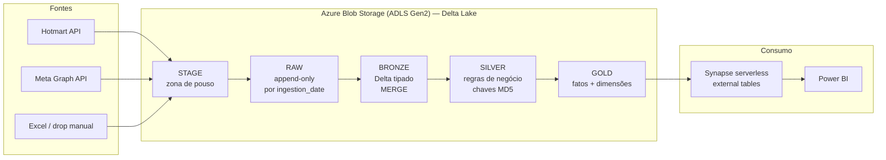

# 🏗️ Data Lakehouse na Azure — Airflow 3 + Delta Lake (sem Spark)

> Plataforma de dados **em produção** que consolida vendas, assinaturas e mídia paga de
> 3 fontes distintas em um lakehouse **medallion (Delta Lake)** na Azure — orquestrada com
> **Apache Airflow 3 rodando em Kubernetes (Astronomer)** e servida ao BI via
> **Synapse serverless** — tudo **sem Spark**, com engine em **Polars + delta-rs**.


---

## 📌 O problema

Uma operação de educação digital vende por **três canais com naturezas completamente
diferentes** — e o time de BI precisava de uma visão única, confiável e diária:

| Fonte | Natureza | Desafio |
|---|---|---|
| **Hotmart** | API REST (vendas + assinaturas) | API pagina em janelas de no máx. 90 dias; status de venda muda **retroativamente** |
| **Meta Ads** (Facebook) | Graph API (campaign / adset / ad) | Conversões e ROAS sofrem **restatement**: a Meta reescreve métricas de dias passados |
| **Voomp** | Planilhas Excel dropadas manualmente | Chegada imprevisível → precisa ser **event-driven**, não agendado às cegas |

## 💡 A solução

Um lakehouse em **arquitetura medallion com 5 zonas** sobre Azure Blob (ADLS Gen2),
com **uma DAG por data mart** + uma DAG de manutenção:



Orquestração: **Airflow 3.2 (Astro Runtime) com KubernetesExecutor** — cada task vira um
pod com requests/limits de memória dimensionados por carga
([`pod_override`](dags/facebook_datamart.py)).

---

## 🔍 Destaques de engenharia

**Lakehouse sem Spark.** As transformações usam **Polars + delta-rs** em pods de poucos
GB de RAM — MERGE, time travel, partition pruning e vacuum de Delta Lake **sem pagar o
custo de um cluster Spark**. Para volumes de data mart (milhões de linhas, não bilhões),
isso corta drasticamente custo e tempo de infraestrutura.

**Incremental com watermark + lookback.** Fontes que reescrevem o passado não aceitam
"pegar só o dia novo". Cada carga lê `max(data)` do bronze e **reprocessa uma janela de
lookback** (Meta ~10 dias de restatement; Hotmart 90 dias de mudança de status), aplicada
via `MERGE` no grão correto — idempotente e à prova de restatement.

**Estratégia de escrita por caso, não dogma** ([include/common/delta_io.py](include/common/delta_io.py)):
- `MERGE` por grão (data + id) — bronze/silver incrementais;
- `delete+append` por janela de datas — fatos gold particionados;
- `overwrite` snapshot — fonte Excel que sempre chega completa;
- dimensões **SCD-1** via MERGE por chave.

**Event-driven onde faz sentido.** O mart Voomp não roda no relógio: um
`WasbPrefixSensor` (deferrable) aguarda o Excel pousar no container e só então dispara a
cadeia — zero execução vazia.

**Interoperabilidade de verdade com o Synapse.** O delta-rs grava datetime naive como
`timestampNtz` (reader v3), que o Synapse serverless **lê como 0 linhas, silenciosamente**.
O helper de escrita normaliza todo datetime para UTC (reader v1) antes do write — bug de
integração real, diagnosticado e resolvido na camada certa
([delta_io.py](include/common/delta_io.py)).

**Operação como cidadã de primeira classe.** Uma DAG semanal dedicada
([maintenance_datamart.py](dags/maintenance_datamart.py)) roda `optimize.compact()` +
`vacuum` em **todas** as tabelas Delta, com retenção de 7 dias — que define, de forma
consciente, tanto a economia de storage quanto a janela de time travel disponível.

**Zero segredo no código.** Credenciais vêm da Connection do Airflow com fallback para
variáveis de ambiente (execução local). Nada hardcoded, `.env` fora do versionamento,
secrets do deployment marcados como *Secret* no Astronomer.

---

## 📊 Os data marts

| DAG | Fonte | Estratégia de carga | Gold |
|---|---|---|---|
| [`hotmart_datamart`](dags/hotmart_datamart.py) | API (sales history + subscriptions) | Incremental: watermark − 90d, fatiado em janelas de 90d (limite da API), MERGE por transação | `f_vendas` + `dim_cliente/produto/oferta/produtor`; `f_assinaturas` |
| [`facebook_datamart`](dags/facebook_datamart.py) | Graph API — 3 entidades em cadeias paralelas | Incremental: watermark − ~10d (restatement), ingest batched com `time_increment` | `f_campaign/adset/ad` (delete+append por janela) + `dim_*` (SCD-1) |
| [`voomp_datamart`](dags/voomp_datamart.py) | Excel na zona stage | Event-driven (sensor) + snapshot overwrite; histórico via versões Delta + partições raw | `f_vendas` + 4 dims; ramo opcional de projeções |
| [`maintenance_datamart`](dags/maintenance_datamart.py) | — | Semanal: compact + vacuum de todas as tabelas Delta | — |

## 🗂️ As 5 zonas

| Zona | Formato | Papel |
|---|---|---|
| **stage** | JSON / Excel | Zona de pouso — API grava aqui, drop manual acontece aqui |
| **raw** | JSON / Excel | Histórico imutável, append-only, particionado por `ingestion_date` |
| **bronze** | Delta | Dado tipado, 1:1 com a fonte, MERGE incremental |
| **silver** | Delta | Regras de negócio, deduplicação, chaves MD5 |
| **gold** | Delta | Fatos + dimensões prontos para BI, particionados para pruning |

O gold é exposto ao Power BI por **external tables no Synapse serverless** — scripts em
[`synapse/`](synapse/).

---

## 🛠️ Stack

| Camada | Tecnologia |
|---|---|
| Orquestração | Apache Airflow 3.2 (Astro Runtime) · KubernetesExecutor · sensores deferrable |
| Processamento | Polars · delta-rs (`deltalake`) — sem Spark |
| Storage | Azure Blob Storage (ADLS Gen2 / HNS) · Delta Lake |
| Serving | Azure Synapse serverless SQL · Power BI |
| Deploy | Astronomer (Astro CLI) · GitHub Actions ([deploy.yml](.github/workflows/deploy.yml)) |

## 📁 Estrutura

```
.
├── dags/                        # 1 DAG por data mart + manutenção
│   ├── hotmart_datamart.py
│   ├── facebook_datamart.py
│   ├── voomp_datamart.py
│   └── maintenance_datamart.py
├── include/
│   ├── common/delta_io.py       # helpers Delta: credenciais, MERGE, overwrite, delete+append
│   ├── hotmart/                 # to_stage / to_raw / to_bronze / to_silver / to_gold
│   ├── facebook/                #   (cada mart segue o mesmo layout por estágio)
│   └── voomp/
├── synapse/                     # external tables (gold → Synapse serverless)
├── .github/workflows/deploy.yml # push na main → astro deploy
├── Dockerfile                   # Astro Runtime 3.2
└── requirements.txt
```

Cada mart segue o **mesmo contrato de pastas por estágio** (`to_stage → to_raw →
to_bronze → to_silver → to_gold`) — adicionar uma fonte nova é replicar o layout, não
reinventar o pipeline.

---

## ▶️ Rodando localmente

Pré-requisitos: **Docker Desktop** + **Astro CLI**.

```bash
# 1. Credenciais (nunca commitadas)
cp .env.example .env   # preencha STORAGE_ACCOUNT_NAME / KEY / conexões

# 2. Sobe o Airflow local (http://localhost:8080)
astro dev start
```

Na UI, despause a DAG desejada e dispare. Localmente o `LocalExecutor` ignora os
`pod_override` de Kubernetes — o mesmo código roda nos dois ambientes sem alteração.

## 🚀 Deploy (produção)

Push na `main` → GitHub Actions → `astro deploy` no deployment Astronomer
(KubernetesExecutor). Variáveis sensíveis ficam como *Secret* no deployment:
`STORAGE_ACCOUNT_NAME`, `STORAGE_ACCOUNT_KEY`, `AIRFLOW_CONN_WASB_DEFAULT` e as
credenciais das APIs (Hotmart / Meta).

---

## 👤 Autor

**Henrique Proscholdt** — Engenharia de Dados · BI
[github.com/proscholdt](https://github.com/proscholdt)
